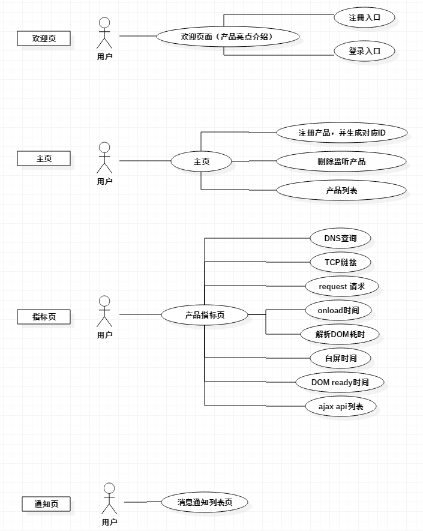
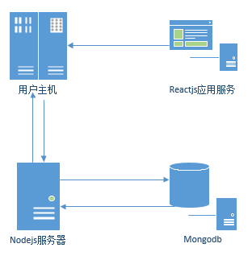
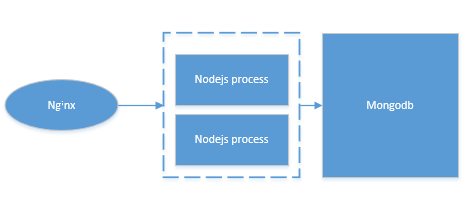

# Web-Performance-Statistics
一个统计web性能参数的工具，旨在检测市场真实用户的使用情况，判断出影响应用性能的模块，为打造高性能web应用的优化策略提供有力的依据。

## 一、web性能指标

<br>
<br>
通过统计用户以上指标真实数据，实现数据可视化，技术专家便可以及时有效的根据这些反馈做出产品的调优策略，另外针对突发异常情况，实现报警功能，通过邮件或者其他的方式，通知到相关技术人员，及时响应，提高产品的服务质量，是维护公司或者产品形象的有力助手。
<br>
<br> 

| 指标       | 参考值           |
| ------------- |:-------------:|
| DNS查询耗时     | 优：10ms /良：50ms/差：100ms |
| TCP链接耗时      | 待定      |
| request请求耗时 | 待定      |
| onload时间 | 待定      |
| 解析DOM耗时 | 待定      |
| 白屏时间 | 待定      |
| dom ready时间 | 待定      |
| 每个ajax耗时 | 待定      |

#### 指标优化策略参考

1.DNS查询优化：

2.TCP链接优化：

3.request请求耗时

4.onload时间优化

5.解析Dom优化

6.白屏时间优化

7.dom ready时间优化

8.ajax优化


## 二、技术方案设计
根据以上需求，从产品完整性来考虑，画出以下产品功能概图
<br>
<br>

<br>
<br>
从整个项目来看，所需要的后台服务计算能力并不十分高，所以选择了nodejs作为后台开发语言，针对nodejs计算能力偏弱的地方，我们可以使用C++模块开发进行性能的提升，有实验证明，在进行相同斐波那契数列计算中，c++的速度约是nodejs的3倍，约是java的1.3倍。从敏捷开发的角度来看，js全栈开发，无论是在功能迭代还是开发进度上都有先天的优势，因此技术架构设计如下：
<br>
<br>


### 2.1 服务端设计和开发

一般公司的服务器都会有几个应用服务在运行，分别占用着不同的端口，因此在这里也按照企业应用开发的思路去设计及部署我们的后台服务，整体的设计如下
<br>
<br>

<br>
<br>
因为我的测试服务器是单核的，所以仅仅是开了双线程，但没有关系，针对多线程的情况，也是使用同样的办法去启用多线程，另外需要注意的是，nodejs的cluster多线程集群默认并发算法已经是比较成熟的了，所以我们只需要使用默认的算法即可，另外还有一个算法，主要思想是把任务分发到对这个任务感兴趣的线程去，理论上这是一个完美的结果，但是实际经验证证明效果并不理想，有兴趣的同学可以自己去研究一下。
#### 数据模型设计
1.用户信息
```
{
    userId:用户ID
    username:用户名
    email:注册email
    password:密码
    products:产品id数据
    noticeList:通知列表
}
```
2.产品信息
```
{
    productId:产品Id
    name:产品名称
    createTime:创建时间
    discription:产品描述
    parametersId:参数ID数组
}
```
3.指标信息 dns/TCP链接/request请求/onload时间/解析Dom/白屏时间/domready时间
```
{
    id:指标ID
    name:指标名称
    values：[
        {
            value:耗时
            time：时间
        }
    ]
}
```
4.通知信息
```
{
    noticeId:通知ID
    name:指标名称
    product：所属项目
    level:紧急程度
    content：内容
}
```

### 2.2 web端设计和开发

