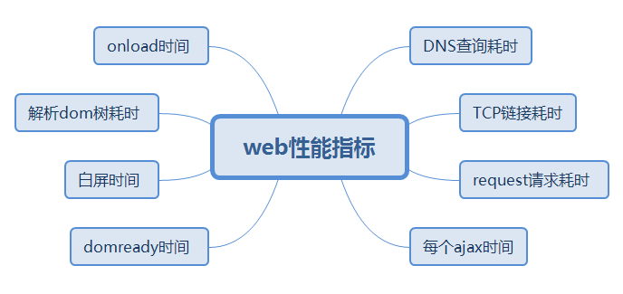

# Web-Performance-Statistics
一个统计web性能参数的工具，旨在检测市场真实用户的使用情况，判断出影响应用性能的模块，为打造高性能web应用的优化策略提供有力的依据。

## 一、web性能指标

<br>
<br>
>通过统计用户以上指标真实数据，实现数据可视化，技术专家便可以及时有效的根据这些反馈做出产品的调优策略，另外针对突发异常情况，实现报警功能，通过邮件或者其他的方式，通知到相关技术人员，及时响应，提高产品的服务质量，是维护公司或者产品形象的有力助手。
<br>
<br> 

| 指标       | 参考值           |
| ------------- |:-------------:|
| DNS查询耗时     | 优：10ms /良：50ms/差：100ms |
| TCP链接耗时      | 待定      |
| request请求耗时 | 待定      |
| onload时间 | 待定      |
| 解析DOM耗时 | 待定      |
| 白屏时间 | 待定      |
| dom ready时间 | 待定      |
| 每个ajax耗时 | 待定      |
```
指标优化策略参考
1.DNS查询优化：

2.TCP链接优化：

3.request请求耗时

4.onload时间优化

5.解析Dom优化

6.白屏时间优化

7.dom ready时间优化

8.ajax优化
```

## 二、技术方案设计


